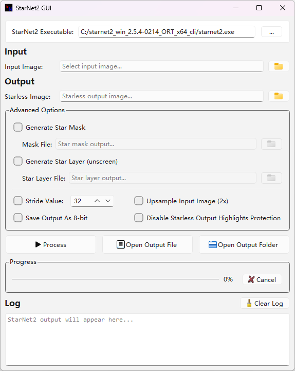

# StarNetGUI

**StarNetGUI** is a simple Windows GUI application for [StarNet](https://starnetastro.com/) that makes star removal easier without using the command line. It provides a graphical interface for running StarNet and processing astrophotography images, with support for generating starless images, star masks, and unscreened images.

## Features

- Simple and easy-to-use Windows GUI
- Remove stars from astrophotography images using StarNet
-  Generate:
    - Starless images
    - Star masks
    - Unscreened images
-  Configure the **stride value**
-  Support for **16-bit and 8-bit** output
-  Optional **2× upsampling**
-  Option to **disable highlight protection for starless output**

## Screenshots

## Requirements

### Operating System

* Windows 10 or later

### StarNet

StarNetGUI requires **StarNet**. Download StarNet from its official website: https://starnetastro.com/

Place `starnet2.exe` in the same directory as `StarNetGUI.exe`, or select it manually from the application. Once selected, StarNetGUI remembers the executable path, so you normally only need to configure it once.

## Installation

### Option 1 — Portable

No installation is required.

1. Download the latest StarNetGUI release.
2. Extract the ZIP file.
3. Make sure `starnet2.exe` is available.
4. Run `StarNetGUI.exe`

### Option 2 — Build from Source

StarNetGUI is written in **C++** using **Qt**.

Recommended development environment:

* Qt 6
* C++20
* CMake

## Why StarNetGUI?

StarNet is a powerful tool for astrophotography, but using it from the command line can be inconvenient for users who prefer a graphical workflow.

StarNetGUI provides a lightweight GUI around StarNet, making common star-removal operations easier to access while keeping the original StarNet processing engine.

## Disclaimer

StarNetGUI is an independent graphical interface for StarNet. It is not affiliated with or endorsed by the StarNet project unless explicitly stated otherwise.
